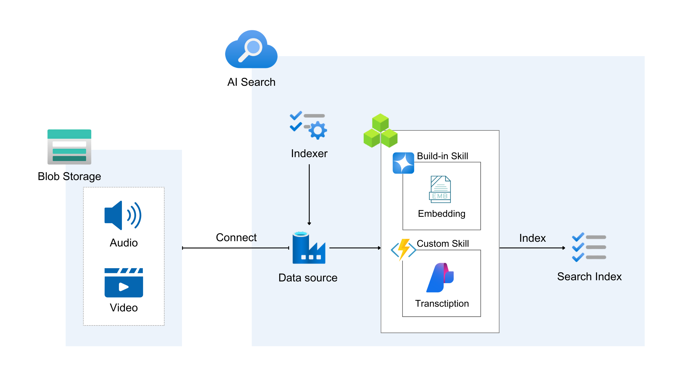

# devdays-asia-2025-azure-student-workshop

## Project Overview

This repository contains the code and resources for the DevDays Asia 2025 student workshop, focusing on building AI applications using Azure services. The workshop covers various topics, including Azure OpenAI, Azure Cognitive Search, and more.

## Azure Pre-requisites

- Subscription
- AI foundry project
- Search Service (Free or Standard tier)
- Azure OpenAI (with `text-embedding-3-large` model deployed)
- Storage account (with a container named `videos`)
- Function App (Flex Consumption plan with Python runtime)

## System Architecture (Indexing Pipeline)



## Setup Instructions

1. **Clone the repository**:
   ```bash
   git clone git@github.com:ReeveWu/devdays-asia-2025-azure-student-workshop.git
   cd devdays-asia-2025-student-workshop
   ```
2. **Create a Python virtual environment**:
   ```bash
    python -m venv .venv
    source .venv/bin/activate  # On Windows use: .venv\Scripts\activate
   ```

## Create Function App

- Navigate to the `backend` directory:
  ```bash
  cd backend
  ```
- Set up the environment variables in Azure Function App (Refer to `config.template.yaml`):

  - `aiService.name`: Name of the AI Service (AI Foundry project).
  - `aiService.subscriptionKey`: Subscription key for the AI service.
- Create a `config.yaml` file based on the `config.template.yaml` and fill in the required values:
  ```bash
  cp config.template.yaml config.yaml
  ```
- Deploy the Function App:
  > [!NOTE]
  >
  > If you haven't installed azure and logged in, please install and log in first.
  >
  > If you are using Ubuntu, please follow the steps below:
  > 
  > - Install prerequisite packages
  > 
  >   ```bash
  >   sudo apt install ca-certificates curl apt-transport-https lsb-release gnupg
  >   ```
  > 
  > - Import the Microsoft signing key
  > 
  >   ```bash
  >   curl -sL https://packages.microsoft.com/keys/microsoft.asc | gpg --dearmor | sudo tee /etc/apt/trusted.gpg.d/microsoft.gpg > /dev/null
  >   ```
  > - Add the Azure CLI software repository
  > 
  >   ```bash
  >   AZ_REPO=$(lsb_release -cs)
  >   ```
  >   ```bash
  >   echo "deb [arch=amd64] https://packages.microsoft.com/repos/azure-cli/ $AZ_REPO main" | sudo tee /etc/apt/sources.list.d/azure-cli.list
  >   ```
  > 
  > - Update and install the Azure CLI
  >   ```bash
  >   sudo apt update
  >   ```
  >   ```bash
  >   sudo apt install azure-cli
  >   ```
  > 
  > - Check whether the installation is successful
  > 
  >   ```bash
  >   az version
  >   ```
  > 
  > - Login
  >   ```bash
  >   az login
  >   ```
  >   Or, If you cannot open browser in the OS (like using WSL or remoting without UI), you should use the command below:
  >   
  >   ```bash
  >   az login --use-device-code
  >   ```
  >   Then, you can open the web URL using any device with any OS and insert the device code which you just got.

## Create Indexing Pipeline (I think this should be removed)

- Install the required packages:
  ```bash
  pip install -r function_app/requirements.txt
  ```
- Navigate to the `create_indexing_pipeline` directory:
  ```bash
  cd create_indexing_pipeline
  ```
- Create a `.env` file based on the `.env.template` and fill in the required values:
  ```bash
  cp .env.template .env
  ```
- Ensure you have the necessary Azure credentials set up in the `.env` file.
- Run the Jupyter notebook `create_aisearch.ipynb` to create the indexing pipeline.

## Next Steps

- Upload videos to the `videos` container in your Azure Storage account.
- Trigger the indexing pipeline to process the videos and create searchable content by running the AI Search Indexer.
