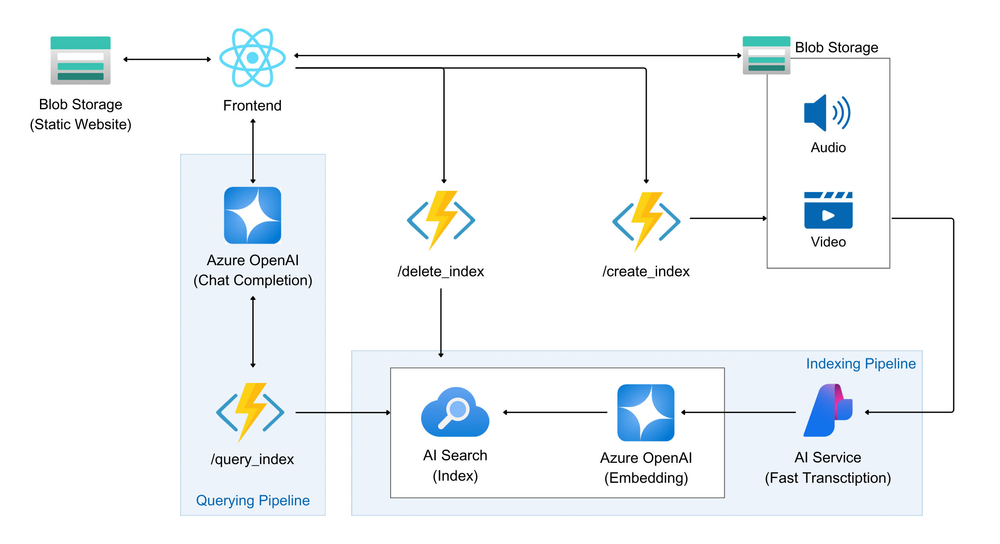

# devdays-asia-2025-azure-student-workshop

## Introduction

This project aims to build a video Q&A experience on Azure. Users can upload videos to Blob Storage, which are then auto-transcribed using Azure AI Services (Speech). The transcriptions are chunked and embedded with Azure OpenAI, indexed into Azure AI Search (supporting both vector and keyword search), and queried via an Azure Functions backend. A React frontend will consume the APIs provided by the backend.

## Architecture



**Components**

* **Storage**: Raw videos in Blob container `videos`
* **Function App (Python)**:
  * `POST /api/index_video` — Transcribe, chunk, embed, index
  * `POST /api/delete_video` — Remove indexed chunks
  * `POST /api/query_video` — Retrieve transcript context
* **Azure AI Services (Speech)** — Fast transcription
* **Azure OpenAI** — Embeddings for vector search
* **Azure AI Search** — Vector index (HNSW + Azure OpenAI vectorizer)

---

## Azure Resources Required

| Resource                            | Purpose                 | Notes                                       |
| ----------------------------------- | ----------------------- | ------------------------------------------- |
| Azure Subscription & Resource Group | All services            | —                                           |
| Azure Storage Account               | Store videos            | Container name: `videos`                    |
| Azure AI Services (Speech)          | Transcription           | Fast transcription API                      |
| Azure OpenAI                        | Embedding generation    | Model: `text-embedding-3-large` (3072 dims) |
| Azure AI Search                     | Vector + keyword search | Free tier or higher                         |
| Azure Functions App (Python)        | Backend APIs            | Plan: Flex Consumption or above             |

---

## Features

This video Q&A system provides:

* **Video Upload & Storage**: Upload videos to Azure Blob Storage
* **Automatic Transcription**: Convert speech to text using Azure AI Services
* **Intelligent Indexing**: Generate embeddings and create searchable vector index
* **Smart Search**: Query video content using natural language
* **Modern Frontend**: React-based user interface for seamless interaction

---

## Technical Stack

### Backend
- **Azure Functions (Python)**: Serverless compute for API endpoints
- **Azure AI Services (Speech)**: Real-time speech-to-text transcription
- **Azure OpenAI**: Text embeddings with `text-embedding-3-large` model
- **Azure AI Search**: Hybrid vector and keyword search index
- **Azure Blob Storage**: Video file storage with public access

### Frontend
- **React 18** with TypeScript for type safety
- **Ant Design (antd)**: Modern UI component library with dark theme
- **Azure SDK**: Integration with Azure services
- **Axios**: HTTP client for API communication

---

## How It Works

### 1. Video Upload Process
- Users upload video files through the React frontend
- Videos are stored directly in Azure Blob Storage using the Azure Storage SDK
- The system supports various video formats and handles large file uploads

### 2. Automatic Processing Pipeline
- Once uploaded, videos trigger the indexing process via Azure Functions
- **Speech Transcription**: Azure AI Services convert audio to text with timestamps
- **Content Chunking**: Transcripts are segmented into meaningful chunks for better search
- **Vector Embedding**: Each chunk is embedded using Azure OpenAI's `text-embedding-3-large`
- **Indexing**: Embeddings and metadata are stored in Azure AI Search

### 3. Intelligent Query System
- Users can ask questions in natural language about video content
- The system performs hybrid search (vector + keyword) to find relevant segments
- Context from multiple relevant chunks is retrieved and presented
- Integration with Azure OpenAI provides conversational responses

---

## Project Structure

```plaintext
devdays-2025/
├── backend/                 # Azure Functions backend
│   ├── function_app/        # Python function app code
│   │   ├── function_app.py  # Main HTTP endpoints
│   │   ├── utils.py         # Helper functions
│   │   └── requirements.txt # Python dependencies
│   ├── create_index/        # Search index setup scripts
│   ├── config.yaml          # Configuration file
│   └── *.sh                 # Deployment scripts
├── frontend/                # React TypeScript frontend
│   ├── src/
│   │   ├── components/      # React components
│   │   │   ├── ChatInterface.tsx    # Chat UI with AI
│   │   │   ├── VideoList.tsx        # Video management
│   │   │   └── VideoUpload.tsx      # File upload
│   │   ├── services/        # Azure service integrations
│   │   └── types/          # TypeScript definitions
│   ├── public/config.js     # Runtime configuration
│   └── package.json        # Node.js dependencies
└── asset/                  # Documentation assets
```

---

## Key Features in Detail

### 🎥 Video Management
- **Drag & Drop Upload**: Intuitive file upload with progress tracking
- **Format Support**: Supports MP4, AVI, MOV, and other common video formats
- **Processing Status**: Real-time updates on transcription and indexing progress
- **Video Library**: Browse and manage uploaded videos with metadata

### 🤖 AI-Powered Chat
- **Natural Language**: Ask questions in conversational language
- **Context-Aware**: Maintains conversation context across multiple queries
- **Streaming Responses**: Real-time response generation with typing indicators
- **Source Attribution**: Shows which video segments provided the answer

### 🔍 Smart Search Technology
- **Hybrid Search**: Combines semantic vector search with traditional keyword search
- **Timestamp Precision**: Locate exact moments in videos where topics are discussed
- **Multilingual Support**: Works with various languages supported by Azure AI Services
- **Relevance Ranking**: Ensure most relevant results appear first

---
## License
This project is licensed under the MIT License. See the [LICENSE](LICENSE) file for details.